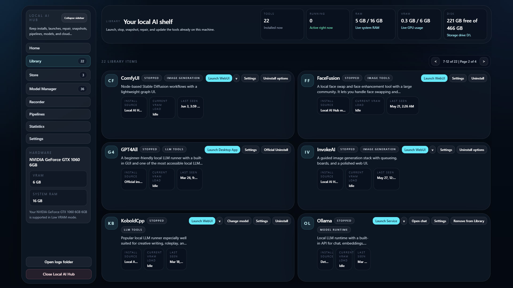
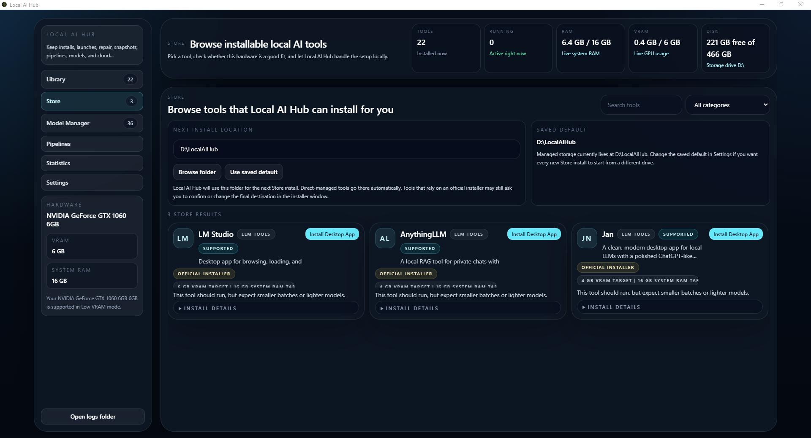
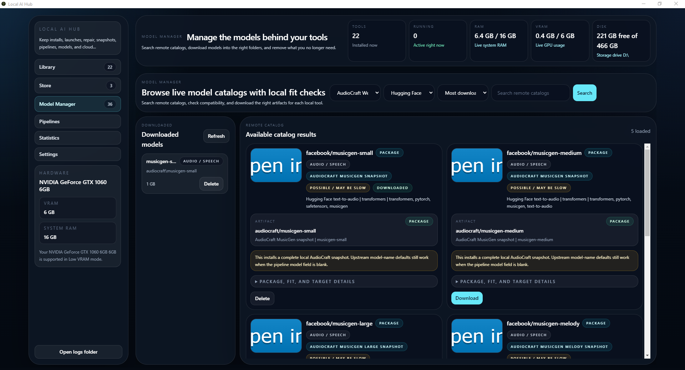
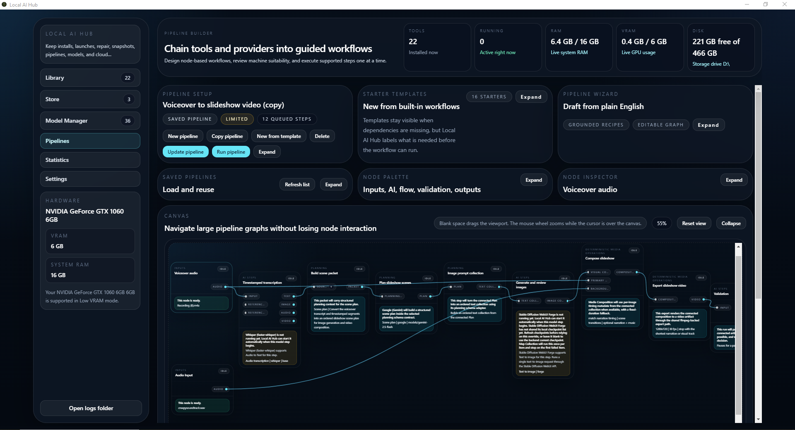
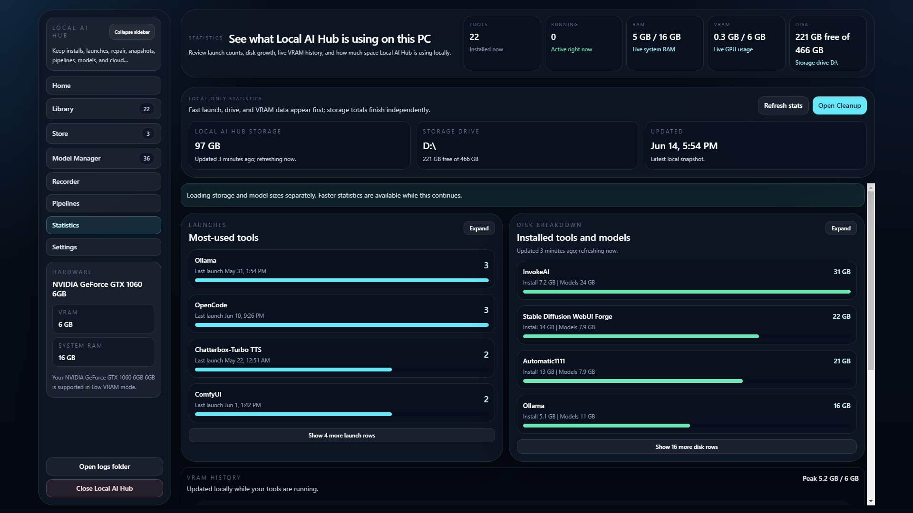
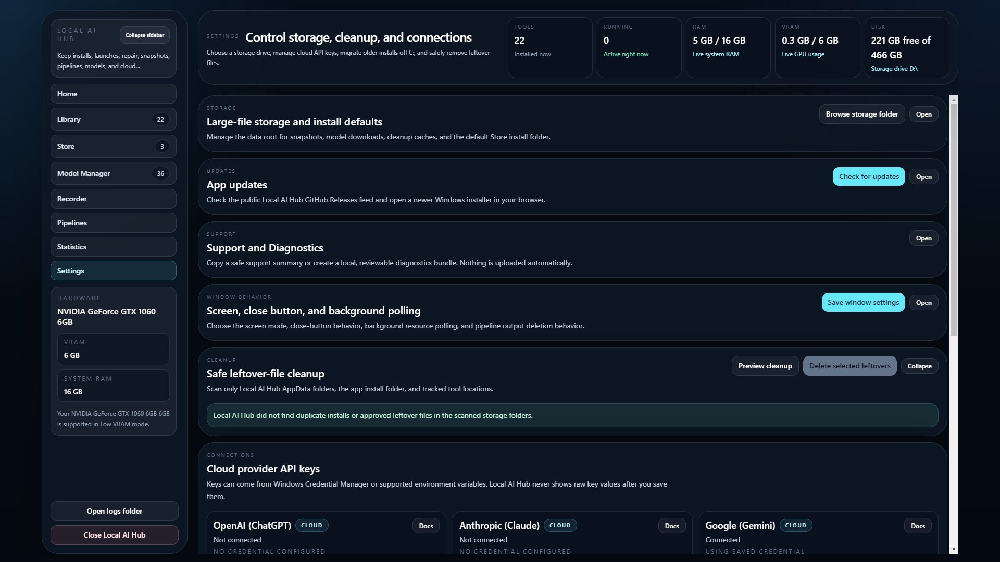

# Local AI Hub

Local AI Hub is a Windows desktop application for installing, launching, monitoring, repairing, and organizing local AI tools from one place. It is designed to make tools such as ComfyUI, Ollama, Automatic1111, InvokeAI, and related model workflows easier to manage, while keeping local workloads and files on the user's own PC.

[Download the latest release](https://github.com/Local-AI-Hub/LocalAIHub/releases/latest) | [Browse all releases](https://github.com/Local-AI-Hub/LocalAIHub/releases)

> Local AI Hub is under active development. Hardware support and tool behavior vary, and some features listed near the end of this README have not yet been validated with real hardware or provider accounts.

## What Local AI Hub Does

Local AI Hub provides a single Windows interface for:

- Browsing, installing, launching, stopping, updating, and repairing supported AI tools.
- Checking GPU, VRAM, system RAM, disk space, and tool suitability before installation.
- Managing local and remote model catalogs and placing downloads in tool-specific locations.
- Saving and restoring tool environment snapshots.
- Building guided pipelines that connect supported local tools and optional cloud providers.
- Reviewing local storage, launch counts, RAM, and VRAM usage.
- Managing storage locations, cleanup, provider connections, and tray behavior.

## Who This Is For

Local AI Hub is intended for Windows users who want to explore local AI without manually coordinating every installer, virtual environment, model folder, and launch command. It is especially useful for people working with mid-range or older GPUs who need clear readiness guidance, but it does not remove the hardware requirements of the tools and models it manages.

## Feature Overview

- **Library:** Control installed tools and provider connections from one dashboard.
- **Store:** Browse supported tools and review hardware-fit guidance before installing.
- **Model Manager:** Search supported model catalogs, download model assets, and manage local copies.
- **Pipelines:** Create reusable, guided workflows across supported text, image, audio, and video tools.
- **Statistics:** Review local storage use, tool launches, and resource history.
- **Settings:** Configure storage, cleanup, asset libraries, cloud provider keys, and window behavior.
- **Recovery tools:** Create snapshots and run repair actions for supported installations.
- **System tray:** Keep Local AI Hub available in the background and quickly reopen or launch tools.

## Screenshots

| Library | Store |
| --- | --- |
| [](docs/screenshots/library.png) | [](docs/screenshots/store.png) |

| Model Manager | Pipelines |
| --- | --- |
| [](docs/screenshots/model-manager.png) | [](docs/screenshots/pipelines.png) |

| Statistics | Settings |
| --- | --- |
| [](docs/screenshots/statistics.png) | [](docs/screenshots/settings.png) |

## Quick Start

1. Open the [latest GitHub release](https://github.com/Local-AI-Hub/LocalAIHub/releases/latest).
2. Download `LocalAIHub-Setup-x.y.z.exe`, replacing `x.y.z` with the current release version.
3. Run the installer. Review the unsigned-installer guidance below if Windows or your browser displays a warning.
4. Start Local AI Hub and review the detected GPU, VRAM, system RAM, and storage information.
5. Browse the Store and check the suitability message for a tool before installing it.

Tool and model downloads can be large. Confirm that the selected storage drive has enough free space before starting an installation.

## Download

Installers are published on the [GitHub Releases page](https://github.com/Local-AI-Hub/LocalAIHub/releases). For a normal Windows installation, download the asset named:

`LocalAIHub-Setup-x.y.z.exe`

The `.blockmap` and `latest.yml` assets support the application's release/update flow and are not the installer users should open manually.

## Windows SmartScreen and Unsigned Installer

Local AI Hub is currently distributed as an unsigned Windows app. Because it is not code signed, Windows SmartScreen, your browser, or antivirus software may warn before the installer runs.

1. Download the installer only from the official [Local AI Hub releases](https://github.com/Local-AI-Hub/LocalAIHub/releases).
2. If your browser blocks the download, open its downloads panel and choose `Keep anyway` if that option is available and you trust the source.
3. Start the installer.
4. If Windows SmartScreen appears, click `More info`, verify the file is the release asset you intended to download, and then click `Run anyway` if you choose to continue.
5. Finish the installation and launch Local AI Hub.

These warnings are expected for an unsigned app, but they are not a reason to ignore normal security precautions. Only continue when the file came from the official repository and you are comfortable running it.

## If Security Software Interferes

Some antivirus tools may block the download, quarantine the installer, or interrupt the first launch. Confirm that the installer came from the official release page before allowing it or the installed app through security software. Do not disable security protections broadly just to complete an installation.

## Local-First and Privacy

Supported local tools run on the user's machine, and Local AI Hub stores its managed files and configuration locally. Network access is still required when the user asks the app to download tools, dependencies, updates, or model assets.

Cloud providers are optional where supported. Requests sent through a connected cloud provider leave the local machine and are handled under that provider's terms and privacy practices. Users must supply their own provider API keys or credentials where applicable.

## Hardware Expectations

Local text, image, video, and audio workloads have different requirements. Image, video, and audio generation can depend heavily on GPU support and available VRAM; larger models, resolutions, and batch sizes generally require more memory and storage. CPU-only or low-VRAM operation may be slower or unavailable for some tools.

Local AI Hub detects supported hardware information and provides suitability or readiness guidance where that support exists. This guidance is a practical estimate, not a compatibility guarantee. Check each upstream tool's requirements before downloading large models or relying on a workflow.

## Development

Requirements:

- Windows
- Node.js and npm
- Additional runtimes or hardware required by the tools you intend to test

Install dependencies and start the development app:

```powershell
npm ci
npm run dev
```

Build the UI or create the Windows package:

```powershell
npm run build:ui
npm run build
```

The full package build writes local artifacts to the ignored `release/` directory.

## Manual Live Provider Validation

`npm run verify:wizard-live` runs the Pipeline Wizard live provider verifier. This is an opt-in manual check only: it uses saved live provider credentials and may consume quota or hit provider rate limits. Keep normal release, push, npm verify, and CI-style validation on mocked/offline wizard verifiers such as `node scripts/verify-pipeline-wizard.js` and `node scripts/verify-pipeline-wizard-lifecycle.js`.

## Untested Features as of v0.46.0

The following features are implemented and covered by automated verification where practical, but have not yet been validated with real-world hardware, local model assets, or live cloud-provider accounts. Treat them as experimental until they are manually tested.

1. Wan 2.1 library launch on a CUDA-capable NVIDIA system
   - with required Wan model assets present

2. Local collectionMap video generation (Wan 2.1)
   - text -> video
   - image -> video
   - previous-last-frame chaining

3. Local Model Step video generation (Wan 2.1)
   - text -> video
   - image -> video

4. Cloud Model Step image generation
   - OpenAI / ChatGPT
   - Google / Gemini
   - xAI / Grok
   - text -> image
   - image -> image

5. Cloud collectionMap image generation
   - OpenAI / ChatGPT
   - Google / Gemini
   - xAI / Grok
   - text -> image
   - image -> image

6. Cloud Model Step video generation
   - Google / Gemini / Veo
   - xAI / Grok Imagine
   - text -> video
   - image -> video

7. Cloud collectionMap video generation
   - Google / Gemini / Veo
   - xAI / Grok Imagine
   - text -> video
   - image -> video
   - previous-last-frame chaining
